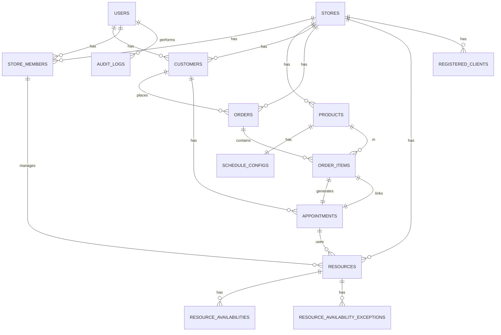

# Nexora - Backend v1

Backend Java/Spring Boot para lojas, catalogo, pedidos, agendamentos e autenticacao de cliente.
O projeto tambem inclui mensageria com RabbitMQ e um dominio interno de recursos e disponibilidade.

## Modelo de Dados



## Stack

- Java 21
- Spring Boot 3.2.5
- Spring Security + JWT (`jjwt`)
- Spring Data JPA
- Bean Validation
- Flyway
- PostgreSQL 16
- RabbitMQ
- Lombok
- MapStruct configurado no `pom.xml`

## Banco de Dados

### Migrations

O projeto usa Flyway para versionamento do schema. As migrations estão em `src/main/resources/db/migration/`:

| Versao | Descricao |
|--------|-----------|
| V1 | Usuarios, lojas e membros |
| V2 | Clientes e produtos |
| V3 | Pedidos, itens e agendamentos |
| V4 | Campo origin em usuarios |
| V5 | Autenticacao, OTP e cliente opcional |
| V6 | Recursos, disponibilidades e sincronizacao de schema |
| V7 | Clientes registrados (API keys) |
| V8 | Auditoria e logs |
| V9 | Adiciona avatarUrl e googleId em usuarios |
| V10 | Implementa campos completos em ResourceAvailabilityException |
| V11 | Adiciona indices de performance e constraints faltando |
| V12 | Adiciona ON DELETE CASCADE em relacionamentos com cascade |

### Schema

14 tabelas principais:
- **users**: Usuarios de lojas (com avatar e Google ID)
- **stores**: Lojas/empresas
- **store_members**: Membros de lojas com papeis
- **customers**: Clientes (opcional: associados a usuario)
- **products**: Produtos com tipos (PHYSICAL, SERVICE)
- **schedule_configs**: Configuracao de agendamento por produto
- **orders**: Pedidos com canais (WPP, WEB)
- **order_items**: Itens de pedido com preco unitario
- **appointments**: Agendamentos com duracao e status
- **resources**: Recursos (PERSON, ROOM, EQUIPMENT)
- **resource_availabilities**: Disponibilidade por dia da semana
- **resource_availability_exceptions**: Excecoes de disponibilidade (datas especificas)
- **registered_clients**: Clientes da API com client key
- **audit_logs**: Auditoria de acoes

## Stack

O repositorio nao inclui Maven Wrapper.

Para rodar com `mvn spring-boot:run`, suba antes o banco e o RabbitMQ:

```bash
docker compose up rabbitmq postgres -d
mvn spring-boot:run
```

Ou suba tudo com Docker:

```bash
docker compose up --build
```

O RabbitMQ expoe a porta `15672` para o painel de management.

## Configuracao

`src/main/resources/application.yml` ativa o perfil `dev` por padrao e valida o schema com Flyway.

| Variavel / propriedade | Padrao | Onde e usada |
|---|---:|---|
| `DB_USERNAME` | `nexora` | Usuario do banco |
| `DB_PASSWORD` | `nexora` | Senha do banco |
| `SPRING_DATASOURCE_URL` | `jdbc:postgresql://postgres:5432/nexora` no Docker | URL do banco no container |
| `SPRING_RABBITMQ_HOST` | `localhost` | Host do RabbitMQ |
| `SPRING_RABBITMQ_PORT` | `5672` | Porta do RabbitMQ |
| `SPRING_RABBITMQ_USERNAME` | `nexora` | Usuario do RabbitMQ |
| `SPRING_RABBITMQ_PASSWORD` | `nexora` | Senha do RabbitMQ |
| `JWT_SECRET` | segredo de desenvolvimento | Assinatura do JWT |
| `JWT_EXPIRATION_MS` | `86400000` | Validade do token |
| `nexora.otp.expiration-minutes` | `5` no perfil `dev` | Validade do OTP |

Notas:
- No `dev`, OTP e email usam mocks.
- No `prod`, os senders atuais ainda lancam `UnsupportedOperationException`.
- `docker compose up --build` sobe Postgres, RabbitMQ e a aplicacao.
- No Docker, `SPRING_DATASOURCE_URL` aponta para o servico `postgres` e `SPRING_RABBITMQ_HOST` aponta para o servico `rabbitmq`.

### Cliente registrado
- as requests da API usam `X-CLIENT-KEY` para identificar o cliente registrado
- se a request vier de browser, o `Origin` precisa estar cadastrado em `registered_clients.allowed_origin`
- `OPTIONS` de preflight ficam liberadas pelo CORS, mas as chamadas reais continuam exigindo a client key
- a tabela `registered_clients` guarda `client_key_hash`, `allowed_origin`, `allowed_ip`, `active` e `last_used_at`

### Auditoria e autorizacao
- os controllers de escrita usam `@Auditable` para gravar eventos em `audit_logs`
- os controllers de loja, produto e pedido usam `@PreAuthorize` com `SecurityUtils`
- `CurrentRequest` carrega IP, origin, referer, user-agent, path, method, usuario e client registrado para o registro de auditoria

## API atual

### Auth publico

`/api/v1/auth/**` nao exige JWT.

| Metodo | Rota | Descricao |
|---|---|---|
| POST | `/api/v1/auth/register` | Cadastro de usuario de loja |
| POST | `/api/v1/auth/login` | Login de loja |
| POST | `/api/v1/auth/customer/register` | Cadastro de cliente e envio de OTP |
| POST | `/api/v1/auth/customer/login` | Login de cliente por telefone ou email |
| POST | `/api/v1/auth/customer/verify-otp` | Validacao do OTP de telefone |
| POST | `/api/v1/auth/forgot-password` | Envio de OTP para redefinicao |
| POST | `/api/v1/auth/reset-password` | Troca de senha com OTP |

Observacoes:
- `customer/register` retorna `202 Accepted`
- `customer/login` no modo telefone retorna `202 Accepted`
- `forgot-password` retorna `202 Accepted`
- `reset-password` retorna `204 No Content`
- as rotas acima continuam sem JWT, mas seguem protegidas por `X-CLIENT-KEY`
- o CORS e validado contra os clientes ativos cadastrados na tabela `registered_clients`

Limitacao atual:
- o JWT pode usar `email` ou `phone` como subject, e o filtro resolve os dois
- o `verify-otp` devolve token com o principal que o usuario tiver cadastrado: email quando existe, senao telefone

### Stores

| Metodo | Rota | Descricao |
|---|---|---|
| POST | `/api/v1/stores` | Cria a loja e vincula o usuario autenticado como `SUPER_ADMIN` |
| GET | `/api/v1/stores/mine` | Lista as lojas do usuario autenticado |
| GET | `/api/v1/stores/{id}` | Retorna os detalhes de uma loja |

### Products

| Metodo | Rota | Descricao |
|---|---|---|
| POST | `/api/v1/stores/{storeId}/products` | Cria produto |
| GET | `/api/v1/stores/{storeId}/products` | Lista produtos da loja |
| GET | `/api/v1/stores/{storeId}/products/{productId}` | Busca produto por id |
| PUT | `/api/v1/stores/{storeId}/products/{productId}` | Atualiza produto |
| DELETE | `/api/v1/stores/{storeId}/products/{productId}` | Desativa produto com `active=false` |

Na listagem de produtos, o query param `active` e opcional.

### Orders

| Metodo | Rota | Descricao |
|---|---|---|
| POST | `/api/v1/orders` | Cria pedido |
| GET | `/api/v1/orders/{orderId}` | Busca pedido por id |
| GET | `/api/v1/orders/store/{storeId}` | Lista pedidos de uma loja |
| GET | `/api/v1/orders/customer/{customerId}` | Lista pedidos de um cliente |
| PATCH | `/api/v1/orders/{orderId}/status` | Atualiza o status do pedido |

Notas:
- `CreateOrderRequest` aceita `storeId`, `customerId`, `channel` e `items`
- cada item pode carregar `estimatedMinutes` e `scheduledAt`
- se o produto tiver `scheduleConfig` e vier `scheduledAt`, o pedido cria uma `Appointment`
- pedidos geram eventos em RabbitMQ

### Resources

| Metodo | Rota | Descricao |
|---|---|---|
| POST | `/api/v1/stores/{storeId}/resources` | Cria recurso (PERSON, ROOM, EQUIPMENT) |
| GET | `/api/v1/stores/{storeId}/resources` | Lista recursos da loja |
| GET | `/api/v1/stores/{storeId}/resources/{resourceId}` | Busca recurso por id |
| PUT | `/api/v1/stores/{storeId}/resources/{resourceId}` | Atualiza recurso |
| DELETE | `/api/v1/stores/{storeId}/resources/{resourceId}` | Desativa recurso |

Notas:
- `CreateResourceRequest` aceita `name`, `type` e `storeMemberId` (opcional)
- tipo pode ser: `PERSON`, `ROOM`, `EQUIPMENT`
- recursos podem ser associados a membros da loja (ex: pessoas)

### Appointments

| Metodo | Rota | Descricao |
|---|---|---|
| GET | `/api/v1/stores/{storeId}/appointments` | Lista agendamentos da loja |
| GET | `/api/v1/stores/{storeId}/appointments/{appointmentId}` | Busca agendamento por id |
| PATCH | `/api/v1/stores/{storeId}/appointments/{appointmentId}/status` | Atualiza status do agendamento |
| GET | `/api/v1/appointments/me` | Lista agendamentos do cliente autenticado |

Notas:
- agendamentos sao criados automaticamente quando um pedido com `scheduledAt` e criado
- statuses: `PENDING`, `CONFIRMED`, `DONE`, `CANCELLED`
- cada agendamento e vinculado a um `resource`, `customer`, `appointment` e `orderItem`

### Store Members

| Metodo | Rota | Descricao |
|---|---|---|
| POST | `/api/v1/stores/{storeId}/members` | Convida/adiciona membro a loja |
| GET | `/api/v1/stores/{storeId}/members` | Lista membros da loja |
| PATCH | `/api/v1/stores/{storeId}/members/{memberId}/role` | Altera papel do membro |
| DELETE | `/api/v1/stores/{storeId}/members/{memberId}` | Remove membro da loja |

Notas:
- `InviteStoreMemberRequest` aceita `userId` ou `email`
- papeis disponiveis: `SUPER_ADMIN`, `MEMBER`
- criar loja vincula o usuario como `SUPER_ADMIN` automaticamente
- apenas `SUPER_ADMIN` pode gerenciar membros

## Seguranca e Autorizacao

### Protecao por @PreAuthorize

- **Qualquer membro da loja**: `@securityUtils.isStoreMember(#storeId)` - lista e leitura
- **Admin da loja**: `@securityUtils.isStoreAdmin(#storeId)` - criacao, atualizacao, delecao
- **Acesso a pedido**: `@securityUtils.canAccessOrder(#orderId)` - loja ou cliente do pedido
- **Acesso a agendamento**: implícito na validacao de storeId

### Auditoria

Todas as acoes de escrita (POST, PUT, DELETE, PATCH) sao auditadas via `@Auditable`:

```
action: STORE_CREATED, PRODUCT_CREATED, ORDER_CREATED, etc
entityType: STORE, PRODUCT, ORDER, APPOINTMENT, etc
entityId: UUID da entidade criada/alterada
user: usuario autenticado
ip, userAgent, origin, path, method: contexto da requisicao
```

## Mensageria

O projeto usa RabbitMQ para eventos de pedido e agendamento.

Exchanges principais:

- `nexora.orders`
- `nexora.appointments`
- `nexora.notifications`

Eventos atuais:

- `order.created`
- `order.status`
- `appointment.created`
- `appointment.status`

Os consumers atuais fazem log e ainda tem TODOs para notificacoes de loja e cliente.

## Dominio interno de agenda

Essas partes ja existem no codigo e nas migrations, mas ainda nao tem controller publico:

- `resources`
- `resource_availabilities`
- `resource_availability_exceptions`
- `schedule_configs`

Essas tabelas sustentam a selecao de recursos disponiveis para pedidos agendados.

## Estrutura

```text
src/main/java/com/nexora/
|-- audit/
|-- config/          # SecurityConfig, JpaConfig, RabbitMQConfig
|-- controller/      # AuthController, StoreController, ProductController, OrderController
|-- dto/
|   |-- request/     # Requests de auth, loja, produto e pedido
|   `-- response/    # Responses da API
|-- exception/       # BusinessException, GlobalExceptionHandler
|-- integration/
|   |-- email/       # EmailSender + mocks/prod
|   `-- otp/         # OtpSender + mocks/prod
|-- messaging/
|   |-- consumer/    # Listeners do RabbitMQ
|   |-- event/       # Eventos publicados
|   `-- producer/    # Publicacao de eventos
|-- model/
|   |-- entity/      # User, Store, Product, Order, Resource, Appointment, etc.
|   `-- enums/       # UserOrigin, StoreRole, ProductType, OrderStatus, etc.
|-- repository/      # Interfaces Spring Data
|-- security/        # JwtService, JwtAuthFilter, RegisteredClientFilter, RateLimitFilter, CurrentRequest, SecurityUtils
`-- service/         # AuthService, OtpService, StoreService, ProductService, OrderService, AvailabilityService, RegisteredClientService
```

## Observacoes

- As rotas fora de `/api/v1/auth/**` exigem JWT, `X-CLIENT-KEY` e passam pelas regras de autorizacao por loja/cliente.
- O schema e validado com `ddl-auto: validate`, entao migrations precisam acompanhar as entities.
- No estado atual, o projeto ainda nao tem testes automatizados em `src/test`.
